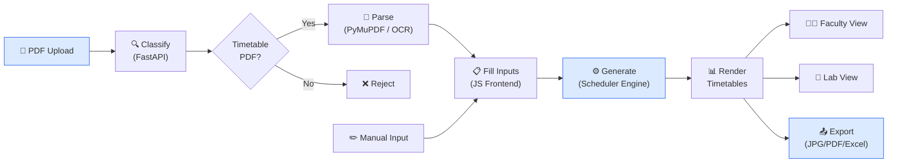

# 📅 Timetable Generator

> **🚧 Work in Progress** — This project is under active development. Many features and improvements are planned. Contributions and feedback are welcome!

A constraint-based college timetable generator with PDF import, drag-and-drop editing, faculty/lab views, and multi-format export. Built with vanilla JavaScript on the frontend and a FastAPI Python backend for PDF classification.

---

## ✨ Features

### Scheduling Engine
- **Multi-class generation** — Generate collision-free timetables for up to 50 classes simultaneously
- **Constraint solver** — Handles teacher clashes, lab room conflicts, credit-hour balancing, and consecutive-period limits
- **Multi-pass optimizer** — Advanced scheduling passes for gap filling, compaction, and teacher workload distribution
- **Input validation** — Real-time validation of subjects, teachers, rooms, and credit hours before generation

### PDF Import Pipeline
- **Timetable classification** — Automatically detects whether an uploaded PDF is a valid timetable
- **Text + OCR extraction** — Dual-mode parsing via PyMuPDF (text) and Tesseract (image-based PDFs)
- **Auto-fill** — Extracted subjects, teachers, and settings populate the input form

### User Interface
- **Faculty view** — Per-teacher timetable with clash detection and workload summary
- **Lab view** — Shared lab room scheduling across all classes
- **Drag & drop** — Manually swap slots with instant conflict validation
- **Keyboard shortcuts** — Quick actions for power users
- **Responsive design** — Works on desktop and tablet screens
- **Auto-save** — All inputs persisted in localStorage

### Export
- **JPG / PDF** — High-quality image export via html2canvas
- **Excel** — Spreadsheet export via SheetJS
- **Bulk export** — Export all classes at once
- **Print-optimized** — Dedicated print stylesheet

---

## 🏗️ Architecture



---

## 📁 Project Structure

```
Project_T/
├── timetable.html                  # Single-page app shell
├── package.json                    # Node config (Jest, ESLint, Prettier)
├── jest.config.js                  # Test runner config
│
├── src/
│   ├── css/                        # Modular stylesheets (6 files)
│   │   ├── base.css                # Reset, variables, typography
│   │   ├── components.css          # Buttons, cards, modals, inputs
│   │   ├── skeleton.css            # Loading skeleton animations
│   │   ├── saas-theme.css          # Color theme & branding
│   │   ├── responsive.css          # Breakpoint-based layouts
│   │   └── print.css               # Print-only styles
│   │
│   └── js/
│       ├── core/                   # Scheduling engine & data layer
│       │   ├── generate.js         # Main generation orchestration
│       │   ├── parser.js           # Input → data structure parsing
│       │   ├── helpers.js          # Constants, utilities, toasts
│       │   ├── input-validator.js  # Form validation rules
│       │   ├── scheduler.js        # Top-level scheduler entry
│       │   └── scheduler/          # Multi-class constraint solver
│       │       ├── index.js        # Scheduler public API
│       │       ├── engine.js       # Core scheduling loop (largest file)
│       │       ├── state.js        # Mutable scheduling state
│       │       ├── assignment.js   # Slot assignment logic
│       │       ├── selection.js    # Subject/teacher selection
│       │       ├── scoring.js      # Slot scoring heuristics
│       │       ├── validation.js   # Constraint checking
│       │       ├── passes.js       # Basic optimization passes
│       │       ├── passes-advanced.js  # Gap-fill, compaction, rebalance
│       │       ├── caps.js         # Period/day caps
│       │       ├── counts.js       # Credit-hour counters
│       │       ├── bootstrap.js    # Initial slot seeding
│       │       ├── publish.js      # Result finalization
│       │       ├── render.js       # DOM table rendering
│       │       └── teacher-helpers.js  # Teacher availability utils
│       │
│       ├── ui/                     # User interface modules
│       │   ├── init.js             # DOM wiring, event binding, persistence
│       │   ├── dragdrop.js         # Drag-and-drop slot swapping
│       │   ├── faculty-panel.js    # Faculty timetable view
│       │   ├── lab-panel.js        # Lab room view
│       │   ├── tabs.js             # Tab switching logic
│       │   ├── skeleton.js         # Loading skeleton renderer
│       │   ├── sidebar-toolbar.js  # Class filter & sidebar controls
│       │   ├── keyboard-shortcuts.js  # Hotkey bindings
│       │   ├── subject-info.js     # Subject detail tooltips
│       │   ├── report-builder.js   # Report data assembly
│       │   ├── report-render.js    # Report DOM rendering
│       │   └── pdf-import/         # PDF import pipeline (10 files)
│       │       ├── index.js        # Import flow entry point
│       │       ├── classify.js     # Backend classification call
│       │       ├── payload.js      # Response → form data mapping
│       │       ├── apply.js        # Client-side auto-fill
│       │       ├── backend-apply.js # Backend-parsed auto-fill
│       │       ├── subject-parse.js # Subject string parsing
│       │       ├── name-review.js  # Teacher name review UI
│       │       ├── text-utils.js   # Text normalization helpers
│       │       ├── ltp-utils.js    # L-T-P credit parsing
│       │       └── constants.js    # Regex patterns & mappings
│       │
│       └── export/                 # Export modules
│           ├── file-save.js        # JPG/PDF save logic
│           ├── capture-helpers.js  # html2canvas wrappers
│           ├── excel.js            # SheetJS Excel export
│           └── bulk.js             # Bulk multi-class export
│
├── tests/                          # Jest test suites
│   ├── setup-globals.js            # Test environment globals
│   └── unit/                       # Unit test files
│       ├── clash.test.js           # Clash detection tests
│       ├── helpers.test.js         # Helper utility tests
│       ├── input-validator.test.js # Input validation tests
│       ├── parser.test.js          # Input parsing tests
│       ├── scoring.test.js         # Slot scoring tests
│       └── validation.test.js      # Constraint validation tests
│
└── python/
    └── import_classifier/          # FastAPI backend service
        ├── app.py                  # API endpoints (/classify, /process)
        ├── settings.py             # Config & thresholds
        ├── schemas.py              # Pydantic request/response models
        ├── signals.py              # Timetable signal detection
        ├── score.py                # Confidence scoring
        ├── extract.py              # PDF feature extraction
        ├── ocr.py                  # OCR fallback (Tesseract)
        ├── process_parser.py       # PDF content parser
        ├── logger.py               # Logging config
        ├── requirements.txt        # Python dependencies
        └── tests/                  # Pytest suite
            ├── conftest.py         # Fixtures & test config
            ├── test_api.py         # API endpoint tests
            ├── test_score.py       # Scoring logic tests
            └── test_signals.py     # Signal detection tests
```

---

## 🚀 Getting Started

### Prerequisites

- **Node.js** ≥ 18 (for running tests)
- **Python** ≥ 3.10 (for PDF import backend)
- **Tesseract OCR** (optional, for image-based PDF import)

### Frontend

No build step required — it's vanilla HTML/CSS/JS.

```bash
# Option 1: Open directly
xdg-open timetable.html          # Linux
open timetable.html               # macOS

# Option 2: Local dev server
python3 -m http.server 5501
# → http://localhost:5501/timetable.html
```

### Backend (PDF Import)

```bash
cd python/import_classifier
python3 -m venv .venv
source .venv/bin/activate         # Linux/macOS
pip install -r requirements.txt
python3 -m import_classifier.app
# → API at http://127.0.0.1:8001
```

### Running Tests

```bash
# JavaScript (Jest)
npm install                       # First time only
npm test

# Python (Pytest)
cd python/import_classifier
source .venv/bin/activate
pytest tests/ -v
```

---

## 🛠️ Tech Stack

| Layer       | Technology                                     |
| ----------- | ---------------------------------------------- |
| Frontend    | Vanilla HTML + CSS + JavaScript (no framework) |
| Styling     | Modular CSS with CSS variables, Inter font     |
| Backend     | Python 3 · FastAPI · Uvicorn                   |
| PDF Parsing | PyMuPDF · pdfplumber · Tesseract OCR           |
| Export      | html2canvas · SheetJS (xlsx)                   |
| Testing     | Jest (JS) · Pytest (Python)                    |
| Linting     | ESLint · Prettier                              |

---

## 📊 Project Stats

| Metric                     | Count   |
| -------------------------- | ------- |
| JavaScript files           | 45      |
| CSS files                  | 6       |
| Python files               | 14      |
| Total JS lines             | ~17,300 |
| Total CSS lines            | ~4,000  |
| Total Python lines         | ~2,900  |
| JSDoc-documented functions | 330+    |
| Section markers            | 165     |
| Jest tests                 | 128     |

---

## 🗺️ Roadmap

Planned improvements (not in any specific order):

- [ ] Increase test coverage across scheduling engine
- [ ] Add dark mode toggle
- [ ] Mobile-responsive layout improvements
- [ ] User authentication & cloud save
- [ ] Undo/redo for drag-and-drop operations
- [ ] Better error messages & user guidance
- [ ] Performance optimization for large timetables (50+ classes)
- [ ] API rate limiting & input sanitization
- [ ] Docker containerization for backend
- [ ] CI/CD pipeline with automated testing

---

## 📄 License

This project is currently unlicensed. A license will be added in a future release.
