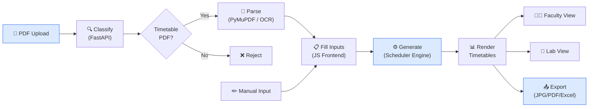

# 📅 Customizable Timetable Generator

Generate, customize, and export collision-free college timetables — with PDF import, drag-and-drop editing, faculty views, and multi-format export.

## ✨ Features

- **Auto-scheduling**: Constraint-based engine that handles teacher clashes, lab rooms, and credit balancing
- **PDF Import**: Extract subjects, teachers, and settings from PDF timetables (text + OCR)
- **Multi-class**: Generate timetables for up to 50 classes simultaneously
- **Faculty View**: Per-teacher timetable with clash detection
- **Lab View**: Shared lab room scheduling across all classes
- **Drag & Drop**: Manually swap slots with instant validation
- **Export**: JPG, PDF, Excel — single or bulk
- **Auto-save**: Inputs are persisted in localStorage

## 🏗️ Architecture



## 📁 Project Structure

```
Project_T/
├── timetable.html              # Main app shell (single HTML page)
├── favicon.svg                 # App icon
├── src/
│   ├── css/timetable.css       # All styles (theme, layout, responsive)
│   └── js/
│       ├── core/               # Scheduling engine, parser, helpers
│       │   ├── generate.js     # Main generation flow
│       │   ├── helpers.js      # Constants, utilities, toasts
│       │   ├── parser.js       # Input parsing
│       │   └── scheduler/      # Multi-class constraint solver (13 files)
│       ├── ui/                 # UI modules
│       │   ├── init.js         # DOM wiring, persistence
│       │   ├── dragdrop.js     # Slot swapping
│       │   ├── pdf-import/     # PDF import pipeline (10 files)
│       │   └── ...
│       └── export/             # JPG, PDF, Excel export
├── python/
│   └── import_classifier/      # FastAPI backend
│       ├── app.py              # API endpoints (/classify, /process)
│       ├── settings.py         # Config & thresholds
│       ├── signals.py          # Timetable signal detection
│       ├── score.py            # Confidence scoring
│       ├── extract.py          # PDF feature extraction
│       ├── ocr.py              # OCR fallback (Tesseract)
│       ├── requirements.txt    # Python dependencies
│       └── tests/              # Pytest test suite
└── README.md
```

## 🚀 Getting Started

### Frontend (No build required)

```bash
# Just open in a browser
open timetable.html
# or use a local server
python -m http.server 5501
```

### Backend (PDF Import)

```bash
cd python
pip install -r import_classifier/requirements.txt
python -m import_classifier.app
# API runs at http://127.0.0.1:8001
```

### Run Tests

```bash
cd python
python -m pytest import_classifier/tests/ -v
```

## 🛠️ Tech Stack

| Layer     | Technology                          |
| --------- | ----------------------------------- |
| Frontend  | Vanilla HTML + CSS + JavaScript     |
| Font      | Inter (Google Fonts)                |
| Backend   | Python FastAPI + Uvicorn            |
| PDF Parse | PyMuPDF, pdfplumber, Tesseract OCR  |
| Export    | html2canvas, SheetJS (xlsx), pdf.js |
